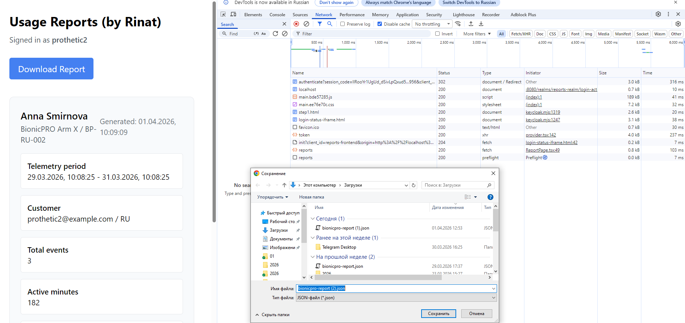

Какие ещё могу предоставить подтверждения? 
Запускаю с этого же репозитория. 
Поменял заголовок на `Usage Reposrts (by Rinat)`. Может была не та ветка

# BionicPRO Sprint 9

В репозитории собраны результаты по двум заданиям проектной работы:

- задание 1: усиление безопасности системы и переход на `PKCE`
- задание 2: разработка сервиса отчетов с `Airflow`, `ClickHouse` и API `/reports`

Ниже кратко указано, что сделано и где это смотреть.

## Что выполнено

### Задание 1

Сделано:

- доработана диаграмма архитектуры в `draw.io`
- реализован `Authorization Code + PKCE` для фронтенда и `Keycloak`
- обновлены настройки клиента `reports-frontend`

Результаты:

- диаграмма: [task1/BionicPRO_C4_model.drawio.xml](task1/BionicPRO_C4_model.drawio.xml)
- пояснение для ревью: [task1/README.md](task1/README.md)
- код фронтенда с `PKCE`: `frontend/src/App.tsx`
- страница `silent check sso`: `frontend/public/silent-check-sso.html`
- обновление токена перед запросом: `frontend/src/components/ReportPage.tsx`
- настройки `Keycloak`: `keycloak/realm-export.json`

### Задание 2

Сделано:

- подготовлена диаграмма архитектуры для сервиса отчетов
- добавлен `Airflow DAG` для ETL из `CRM` и телеметрии в `ClickHouse`
- подготовлена витрина отчетности в `OLAP БД`
- добавлен backend API `/reports`
- реализовано ограничение доступа: пользователь получает только свой отчет
- обновлен UI для запроса и скачивания отчета

Результаты:

- диаграмма: [task2/BionicPRO_C4_reports.drawio.xml](task2/BionicPRO_C4_reports.drawio.xml)
- пояснение для ревью: [task2/README.md](task2/README.md)
- код `Airflow`: `airflow/`
- DAG ETL: `airflow/dags/reports_etl.py`
- backend API: `backend/app/main.py`
- проверка токена и ограничение доступа: `backend/app/auth.py`
- UI для отчета: `frontend/src/components/ReportPage.tsx`
- инфраструктура сервисов: `docker-compose.yaml`
- инициализация `ClickHouse`: `clickhouse/init/001-init.sql`
- тестовые данные `CRM`: `crm/init/001-init.sql`
- тестовые данные телеметрии: `telemetry/init/001-init.sql`

## Дополнительно

- подробности по заданию 1: [task1/README.md](task1/README.md)
- подробности по заданию 2: [task2/README.md](task2/README.md)
- запуск локального окружения: `docker compose up --build -d`
